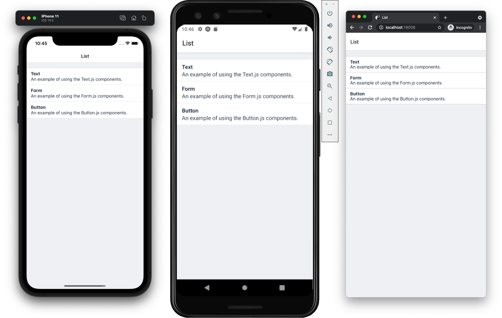
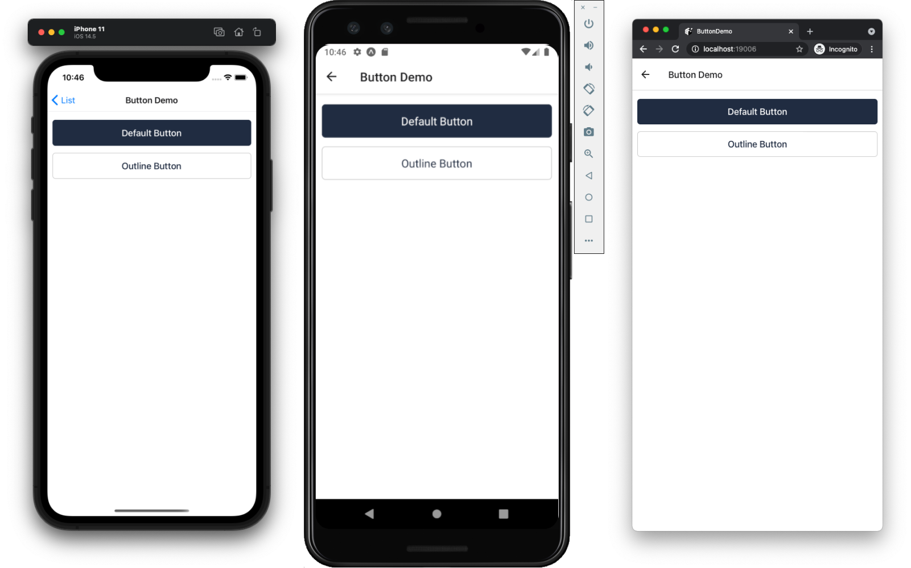

# React Native School React Native TypeScript Template

A simple React Native template with the following features:

- All TypeScript
- Eslint & Prettier configured
- React Navigation v5
- Testing Configured
- Simple project structure
- Small component library to get started with

It's easy to create a project, strip out the few components included, and still have the architecture in place to quickly start building an app.

## Installation

> Be sure to have the [React Native CLI](https://reactnative.dev/docs/environment-setup) installed.

```bash
npx react-native init AppName --template @react-native-school/react-native-typescript-template
```

## Usage

- Run on iOS: `yarn ios` or `npm run ios`
- Run on Android: `yarn android` or `npm run android`
- Compile TypeScript: `yarn tsc`
- Run Tests: `yarn test` or `npm run test`
- Lint Code: `yarn lint` or `npm run lint`
- Format Code: `yarn format` or `npm run format`

## Screenshots

List Screen


Text Screen


Form Screen


Button Screen

